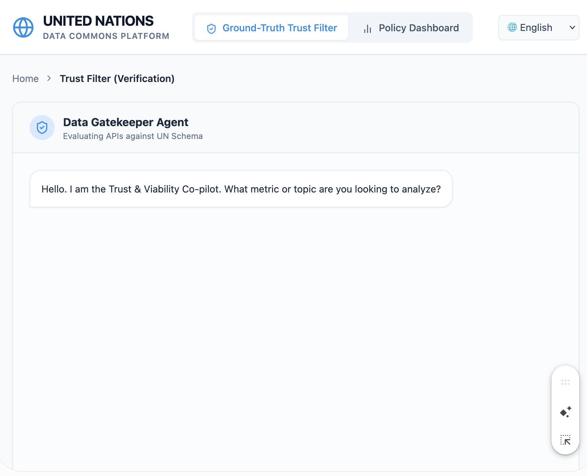
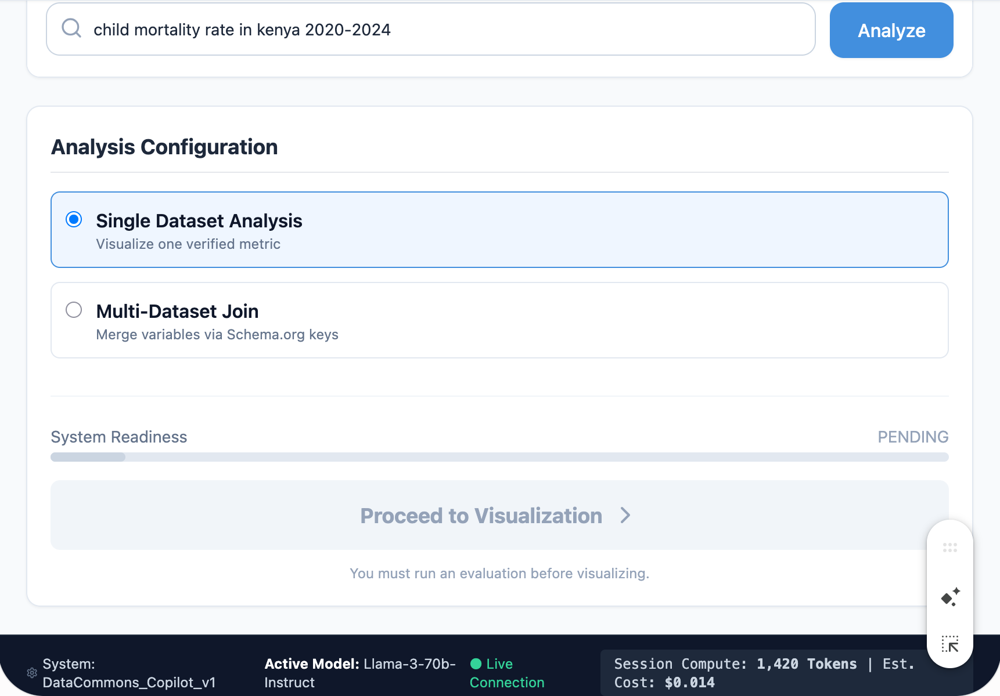
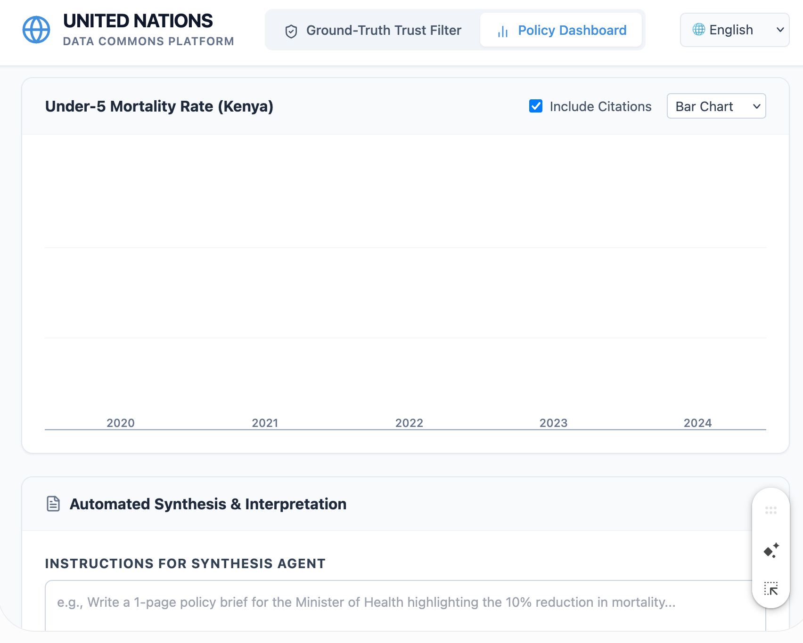
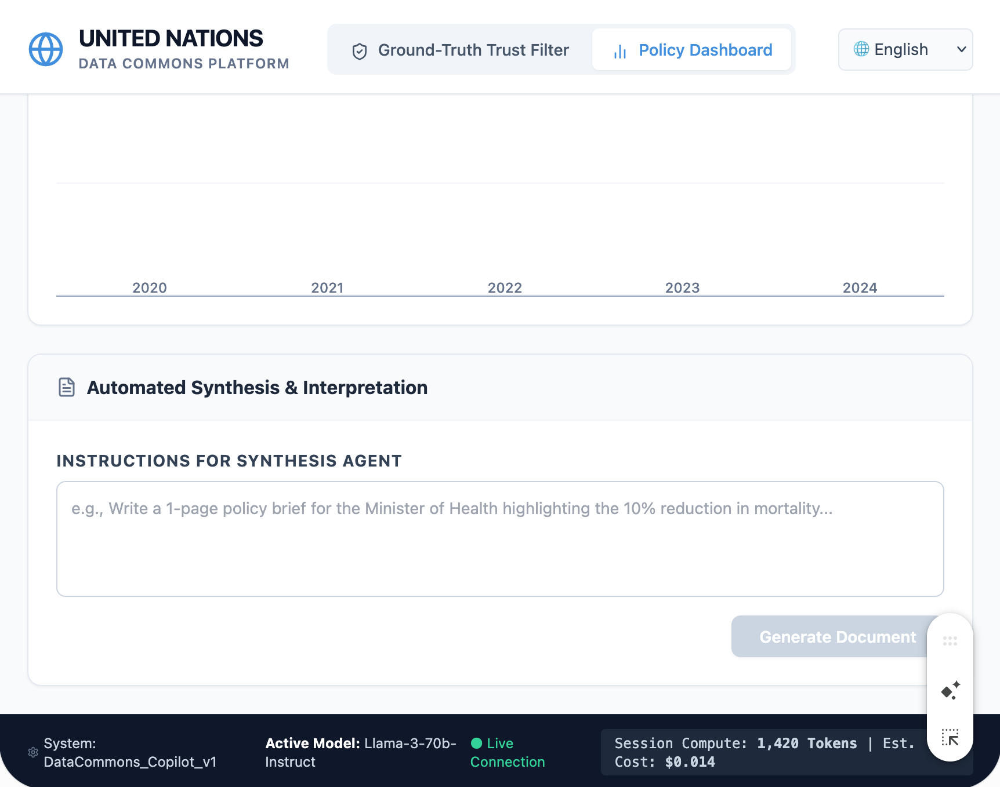

# Implementation Plan: Query Trust & Viability Assessor

## 1. Challenge Background

The UN Data Commons is meant to make public development data easy to discover, access, and combine. But access alone doesn't make an answer trustworthy. As LLMs and agentic systems increasingly generate briefs, dashboards, and narratives from this data, a response can be fluent and well-formatted while still being wrong, poorly sourced, or simply unsuited to the question being asked.

This challenge starts from the user's query, not from the dataset, and asks a single question:

> **Can this specific query be answered responsibly, given the data, metadata, and methodological context actually available?**

The deliverable is a tool that makes that judgment *explicit* — a score, a trust report, or a QA gate — backed by visible evidence (source lineage, metadata completeness, data quality, freshness, methodological notes) rather than a confident-sounding but unverifiable answer.

This plan defines a **minimum viable, end-to-end implementation**: the smallest pipeline that takes a natural-language query in and produces an evidenced trust verdict out. It deliberately excludes multi-source comparison, uncertainty propagation, and reusable-schema design — these are documented as explicit next increments, not part of the MVP.

---

## 2. Design Principles

These principles govern every step below and should be the first thing re-checked if a design decision is in doubt.

1. **Determinism before judgment.** Anything that can be computed with a rule or a plain function must be. The LLM is used only where natural language is genuinely required (parsing the query, narrating a verdict) — never to decide a score it could instead compute.
2. **Every score must be explainable in one sentence.** If a dimension's score can't be traced back to a specific metadata field or data check, it doesn't belong in the MVP.
3. **One query, one source, three dimensions.** No source routing, no cross-source reconciliation, no agentic loops. Breadth is a v2+ concern.
4. **The verdict is a visible rule, not a black box.** APPROVED / QUALIFIED / REJECTED must come from a documented threshold rule over the three dimension scores, so the "opinion" about what counts as trustworthy is inspectable and arguable, not buried in an LLM's reasoning.
5. **Fail loudly, not silently.** If the API call fails, if metadata is missing entirely, or if the query can't be parsed, the pipeline should surface that as a low-confidence/REJECTED result with a clear reason — never a default success.

---

## 3. End-to-End Architecture (MVP)

```
[User Query]
     │
     ▼
Step 1 — Query Parsing (LLM + Pydantic)
     │  → StructuredQuery
     ▼
Step 2 — Data + Metadata Fetch (deterministic, single API)
     │  → RawDataset, RawMetadata
     ▼
Step 3 — Dimension Scoring (deterministic, no LLM)
     │  → DimensionScores (completeness, quality, freshness)
     ▼
Step 4 — Verdict Rule (deterministic) + Narration (LLM)
     │  → TrustVerdict (label + evidence + caveat text)
     ▼
[Trust Report shown to user]
```

Five components, four steps, one LLM call for parsing and one for narration. No loops, no agent framework, no orchestration library required — a single Python script or notebook should be able to run this top to bottom.

---

## 4. Step-by-Step Specification

### Step 1 — Query Parsing

**Purpose:** Convert the user's free-text question into the minimal structured parameters the rest of the pipeline needs to act deterministically. This is the only place ambiguity from natural language is allowed to enter the system — everything downstream operates on the structured object, never on the raw string again.

**Input:** Raw user query string (e.g., *"What's the poverty rate in Kenya over the last 5 years?"*).

**Output:** A `StructuredQuery` object, validated by a Pydantic schema, with these fields at minimum:

| Field | Type | Notes |
|---|---|---|
| `indicator` | `str` | Best-guess canonical indicator name or keyword (e.g., "poverty rate") |
| `geography` | `str` | Country/region as stated or inferred (ISO code preferred if resolvable) |
| `time_range` | `tuple[int, int] \| None` | Start/end year if specified; `None` if not given |
| `comparison_requested` | `bool` | True if the query implies comparing across time/place/source — informs later steps even if v1 doesn't act on it |

**Design notes:**
- Single LLM call, structured output mode (or function-calling/tool-use) constrained to the Pydantic schema — do not free-text parse with regex.
- **Do not use a model-reported `confidence` field as a short-circuit trigger.** LLMs are not well calibrated for this — a model can output a fabricated ISO code or a nonexistent indicator name while self-reporting 0.99 confidence. A confidence float is a feeling, not a fact, and should not be trusted to gate anything.
- **Use Pydantic's own validators as the short-circuit trigger instead.** Write strict, deterministic field validators on `StructuredQuery` itself:
  - `geography` must validate against a hardcoded list of valid ISO-3166-1 alpha-3 codes (or a small fixed set of region names if the chosen API uses those) — reject anything not on the list.
  - `time_range`, if present, must fall within a sane bound (e.g., `1950 <= year <= 2030`) and `start <= end`.
  - `indicator` must be non-empty and, if the chosen API in Step 2 exposes a fixed indicator catalog, should validate against that catalog rather than being accepted as free text.
  - If any validator raises `ValidationError`, the pipeline short-circuits immediately to a REJECTED verdict with reason "query parameters failed validation: \<field\>." This is a deterministic, inspectable gate — not a self-assessment from the same model that might be wrong.
- Do not attempt indicator-code resolution against a live taxonomy in the MVP (e.g., resolving to an exact World Bank indicator ID) unless the chosen API requires it for the fetch in Step 2 — keep this step focused on *intent*, not catalog matching. Where it is required (see Step 2), the ISO/indicator validators above should be backed by that same fixed catalog so there's one source of truth, not two.

---

### Step 2 — Data + Metadata Fetch

**Purpose:** Deterministically retrieve one dataset and its accompanying metadata for the parsed query, from exactly one fixed data source. No routing logic, no fallback sources, no retries across APIs.

**Input:** `StructuredQuery` from Step 1.

**Output:**
- `RawDataset`: the raw rows/values returned by the API (e.g., a DataFrame: geography, year, value).
- `RawMetadata`: whatever metadata fields the same API exposes for that dataset/indicator — typically some subset of: definition, unit, source organization, methodology note, last-updated date, license, geographic coverage notes.

**Design notes:**
- **Hardcode the World Bank Data360 API (or the UN SDMX API) — do not use HDX for the MVP.** This is not an arbitrary preference between two equally good options. HDX is a CKAN-based file catalog: metadata is uploader-supplied, inconsistent in field naming, and very often missing fields entirely (methodology notes, units, even last-updated dates). Building Step 3's metadata-completeness check against HDX means `metadata_completeness` will score near 0.0 for most real queries — not because the tool is working correctly, but because the source itself doesn't structure its metadata. World Bank Data360 and the UN SDMX API, by contrast, enforce a standardized schema (SDMX), which guarantees the structured fields Step 3 needs actually exist to be checked. Source choice is not a detail here — it determines whether the rest of the architecture has anything real to evaluate.
- Do not attempt to integrate the UN Data Commons MCP interface, IATI, and World Bank simultaneously in v1; that's a v2+ "multi-source" feature.
- This step does **no judgment** — it does not decide if the data is good, only fetches it as-is. Resist the temptation to filter or clean here; raw output only, so Step 3's checks are operating on what a real user query would actually get back, warts included.
- Handle and pass through fetch failures explicitly (e.g., 404, malformed response) as a typed `FetchError` rather than letting an exception propagate.
- **Explicitly distinguish "fetch failed" from "fetch succeeded but returned zero rows."** A `200 OK` with an empty result set is the most common real-world outcome — the indicator and country both exist in the catalog, but no observations exist for the requested `time_range`. This is not an error and not a quality issue; it's a distinct, common case and must short-circuit on its own: if `RawDataset` has 0 rows, do not proceed to Step 3's scoring at all. Yield the verdict directly as REJECTED with the caveat "Indicator exists, but no data available for the requested parameters" — there is nothing for metadata-completeness or freshness checks to meaningfully evaluate against zero rows, and running them anyway would produce misleading scores (e.g., metadata could score 1.0 while there's literally no data).

---

### Step 3 — Dimension Scoring

**Purpose:** Compute three independent, named trust dimensions from `RawDataset` and `RawMetadata`, using plain deterministic code. This is the evidentiary core of the tool — every score produced here must be traceable to a specific field or check.

**Input:** `RawDataset`, `RawMetadata` (or `FetchError` from Step 2). By the time Step 3 runs, Step 2 has already guaranteed `RawDataset` contains at least one row — empty results and fetch errors are short-circuited before reaching this step (see Step 2's fast-fail notes).

**Output:** A `DimensionScores` object:

| Field | Type | Computed from |
|---|---|---|
| `metadata_completeness` | `float (0-1)` + `list[str]` missing fields | Presence/absence of required metadata fields |
| `data_quality` | `float (0-1)` + `list[str]` issues found | Missingness, duplicates, out-of-range/negative values where invalid, type consistency |
| `freshness` | `float (0-1)` + `int` days since update | `last_updated` metadata field vs. current date |

**Design notes — keep each dimension to a fixed, small rule set:**

- **Metadata completeness:** Define a fixed required-field checklist up front (e.g., `unit`, `geography_coverage`, `time_coverage`, `source_org`, `license`, `methodology_note`). Score = `present_fields / required_fields`. List exactly which fields were missing — this list becomes the caveat text in Step 4, so capture it as data, not just a number.
- **Data quality:** A handful of cheap, explainable checks is enough — percentage of null/missing values, duplicate row detection, and a basic range/sanity check (e.g., a poverty rate outside 0–100 is invalid). This is the natural place to use `pandas`/Polars directly; a full Great Expectations suite is not necessary for the MVP and adds setup overhead disproportionate to a 3-check scope.
- **Freshness:** A flat threshold is acceptable for v1 (e.g., updated within 2 years → 1.0, within 5 years → 0.6, older → 0.2). Do not try to make staleness tolerance indicator-specific yet (population vs. GDP growth have different natural update cadences) — note this as a v2 refinement rather than building it now.
- No LLM involvement anywhere in this step. If a check can't run because metadata is absent, score that dimension as `0.0` and record the reason — don't skip it silently.

---

### Step 4 — Verdict Rule + Narration

**Purpose:** Turn the three dimension scores into (a) a transparent, rule-based label, and (b) a short human-readable explanation grounded in the actual evidence collected above.

**Input:** `DimensionScores`.

**Output:** A `TrustVerdict` object:

| Field | Type | Notes |
|---|---|---|
| `label` | `Literal["APPROVED","QUALIFIED","REJECTED"]` | From the fixed rule below |
| `dimension_scores` | `DimensionScores` | Pass-through, so the report can show the breakdown, not just the label |
| `explanation` | `str` | 2–4 sentence narration, LLM-generated from the scores and issue lists |

**Verdict rule (deterministic, documented, and meant to be argued with):**

Dimensions are **not weighted equally.** Treating metadata completeness and data quality as interchangeable is statistically dangerous: a dataset with perfect metadata and a fresh update timestamp but 55% null values is garbage, and no amount of good documentation makes it usable. `data_quality` gets a stricter, asymmetric floor than the other two dimensions:

```
if dimension_scores.data_quality < 0.6:
    label = REJECTED        # data quality has its own hard floor —
                             # bad data is disqualifying regardless of
                             # how complete or fresh its metadata is
elif any other dimension score < 0.4:
    label = REJECTED
elif all dimension scores >= 0.7:
    label = APPROVED
else:
    label = QUALIFIED
```

**Design notes:**
- The specific numbers above (0.6 floor on `data_quality`, 0.4 floor elsewhere, 0.7 for APPROVED) are a **policy choice, not a derived fact** — same as the original flat rule, just correctly shaped. Document them in the README as an explicit, named threshold table so they're visible and arguable, not just embedded in an `if` statement. Anyone disagreeing with where the floor sits should be able to point at one line, not reverse-engineer it from code.
- This rule is intentionally simple and intentionally visible — it *is* the project's stated opinion about what "trustworthy enough" means, which directly answers the challenge's call to "be opinionated about what trust means in practice."
- The asymmetry itself is the opinion worth stating out loud: documentation quality and data quality are not substitutable. A well-documented bad dataset is still a bad dataset.
- **The narration LLM must be constrained as a mechanical transcriber, not a writer.** Even when given only `DimensionScores` and the issue lists, an LLM left to "narrate" will tend to be helpful in exactly the wrong way — inventing plausible-sounding reasons *why* a field is missing, or surfacing imagined risks that were never actually detected. The system prompt for this call must say, explicitly: *"You are a mechanical transcriber. You may only convert the provided JSON issue lists into readable sentences. You are strictly forbidden from adding context, speculating on reasons for missing data or low scores, or generating caveats that do not appear in the input arrays."* This is a hard constraint, not a tone preference — the report's credibility depends on every sentence in `explanation` being traceable to a specific entry in `DimensionScores`, with nothing added. The model does not see the raw data and does not get to override `label` under any circumstance.
- The final report shown to the user should surface all three dimension scores individually, not just the rolled-up label — a REJECTED verdict is far more useful to a user when it says *which* dimension failed and why.

---

## 5. Data Contracts Summary

These four objects are the entire interface surface of the MVP. Each step takes the previous step's output type and nothing else — this is what keeps the pipeline testable in isolation (each step can be unit-tested against a hand-built fixture of the previous step's output without running the rest of the system).

```
StructuredQuery   → produced by Step 1, consumed by Step 2
RawDataset/
RawMetadata       → produced by Step 2, consumed by Step 3
DimensionScores   → produced by Step 3, consumed by Step 4
TrustVerdict      → produced by Step 4, shown to user
```

---

## 6. Explicitly Out of Scope for the MVP

Listed here so they aren't accidentally built early, and so the upgrade path is clear:

- Multi-source fetching and cross-source discrepancy detection
- Source authority and methodological-credibility scoring as separate dimensions
- Uncertainty propagation (confidence intervals, estimation flags, revision history)
- LLM-as-judge for the verdict (the rule is deterministic by design, not by omission)
- A reusable API/schema for other Commons tools to call independently
- Indicator-code resolution against a live taxonomy/catalog
- Indicator-specific freshness thresholds

---

## 7. Suggested Build Order

1. Define the four Pydantic schemas (`StructuredQuery`, `RawDataset`/`RawMetadata`, `DimensionScores`, `TrustVerdict`) before writing any pipeline logic.
2. Build and unit-test Step 3's three scoring functions against a hand-written CSV + metadata fixture — this has no external dependencies and de-risks the core logic first.
3. Wire up Step 2 against the chosen single API, feeding real data into the already-tested Step 3 functions.
4. Add Step 1 (LLM parsing) last, once there's a working deterministic pipeline to feed.
5. Add Step 4's narration LLM call and assemble the final report output.

This order front-loads the deterministic, testable core and treats both LLM calls as the last, most replaceable pieces — consistent with the principle that judgment should be earned by evidence, not assumed by the model.


## 8. FRONTEND PLANNING: Trust & Viability Copilot 
**Tech Stack:** React (Next.js preferred for API route handling), Tailwind CSS, Lucide React (for icons).

## 2. Global Layout & Styling
Follow the provided high-fidelity mockups for styling. The design system is clean, enterprise-grade, and minimalist.
* **Colors:** White/Off-white backgrounds, distinct blue accents for active states and primary buttons (`bg-blue-500` or similar), gray text for secondary information.
* **Typography:** Sans-serif, clean hierarchy.
* **Structure:**
    * **Header:** Fixed top. Left: "UNITED NATIONS Data Commons Platform" logo. Center: Toggle buttons for "Ground-Truth Trust Filter" (Active) and "Policy Dashboard". Right: Language dropdown ("English").
    * **Main Container:** Centered, max-width constrained, light gray background to pop the white cards.
    * **Footer (Sticky Bottom):** Dark banner displaying active system stats (System Name, Active Model, Live Connection status, Token usage, Cost tracker).

## 3. Core Components

### A. The Agentic Chat Interface (Page 1 equivalent)
* **Component:** `ChatContainer.tsx`
* **Behavior:** Displays the conversation history. 
* **Initial State:** Shows a card with a blue shield icon and the text: "Data Gatekeeper Agent: Evaluating APIs against UN Schema". Below it, an initial system message bubble: "Hello. I am the Trust & Viability Co-pilot. What metric or topic are you looking to analyze?"

### B. The Analysis Configuration Panel (Page 2 equivalent)
* **Component:** `AnalysisConfig.tsx`
* **Search Bar:** Large input field with a search icon (e.g., placeholder "child mortality rate in kenya 2020-2024") and a prominent "Analyze" button.
* **Radio Selectors:** Two distinct card-style radio buttons for "Single Dataset Analysis" and "Multi-Dataset Join". Active state should have a blue border and blue radio indicator.
* **Readiness Bar:** A progress bar component labeled "System Readiness" (status: PENDING, EVALUATING, READY).
* **Call to Action:** A large, disabled-by-default "Proceed to Visualization" button.

## 4. Backend Integration & Parsing Logic (CRITICAL)
The current backend outputs a raw terminal string (e.g., "TRUST & VIABILITY REPORT... Overall: VIABLE"). Do not simply dump this raw text into the UI.

**Task for AI:** Create an API route (e.g., `/api/evaluate`) that executes the backend script. 
* **If the backend returns JSON:** Map the JSON to the UI components.
* **If the backend returns raw terminal text:** Write a utility function (`parseTerminalOutput(text)`) on the server side that extracts:
    1.  Candidate Datasets (Name, ID)
    2.  Overall Status (VIABLE / CONFLICT)
    3.  Scores (Metadata %, Quality %, Freshness %)
    4.  Source Conflicts (List of differing values and sources)
* Pass this structured object to the frontend.

## 5. Implementation Steps for Claude Code
1.  **Initialize:** Set up the React/Next.js environment and install Tailwind CSS and Lucide React.
2.  **Scaffold Layout:** Build the Header and the dark Footer (with hardcoded placeholder stats for now).
3.  **Build Static UI:** Implement the `AnalysisConfig` panel and the initial `ChatContainer` state exactly as shown in the screenshots.
4.  **Connect Backend:** Create the API wrapper to call the existing backend script. Implement the text-parsing utility to convert the terminal output into a structured JavaScript object.
5.  **Dynamic Rendering:** Update the `ChatContainer` to display the parsed backend data as formatted UI cards (e.g., a green "Viable" badge, a red "Conflict" warning box, and a clean list of candidate datasets) instead of a single block of monospace text.
6.  **State Management:** Wire the "Analyze" button to trigger the API, show a loading state on the "System Readiness" bar, and unlock the "Proceed to Visualization" button upon success.

## Design mockups

### Image 1


### Image 2



## 8. FRONTEND PLANNING: Policy Dashboard
Implement the "Policy Dashboard" view for the UN Data Commons web application. This page serves two purposes:
1. **Integrated Flow:** It receives verified dataset parameters handed off from the "Ground-Truth Trust Filter" page via the "Proceed to Visualization" button.
2. **Standalone Flow:** It allows users to directly input a UN Data Commons API endpoint to generate a visualization independently.

**Tech Stack:** Next.js (App Router), Tailwind CSS, Lucide React, Recharts (or Chart.js) for data visualization.

## 2. Global Navigation & Handoff Logic
* **Routing:** Ensure the top navigation tabs ("Ground-Truth Trust Filter" and "Policy Dashboard") correctly route between `/` (or `/trust-filter`) and `/policy-dashboard`.
* **State Transfer:** When a user clicks "Proceed to Visualization" on the Trust Filter page, pass the dataset ID and metadata (e.g., `?dataset=sdg/SH_H2O_SAFE&country=BGD`) via URL search parameters or a global context provider.

## 3. Core Components

### A. The Visualization Panel (Top Section)
* **Component:** `VisualizationCard.tsx`
* **Empty State (For Standalone Use):** If no URL parameters are detected, display a centered input field labeled "Enter Data Commons API Endpoint" with a "Load Data" button.
* **Loaded State (From Handoff or API Input):** * **Header:** Display the dataset title (e.g., "Under-5 Mortality Rate (Kenya)").
    * **Controls (Top Right):** * Checkbox: "Include Citations" (Appends source watermarks/text to the chart).
        * Dropdown: Chart Type selector (Bar Chart, Line Chart, Pie Chart).
        * Button (Icon): "Download Chart" (Uses standard canvas export to save the chart as a PNG/SVG).
    * **Chart Area:** Use Recharts to render a placeholder chart with standard X/Y axes (e.g., Years 2020-2024 on the X-axis).

### B. Automated Synthesis & Interpretation (Bottom Section)
* **Component:** `SynthesisEngine.tsx`
* **UI Layout:** Match the provided mockup. A clean, white card titled "Automated Synthesis & Interpretation" with a file-text icon.
* **Input Area:** * Label: "INSTRUCTIONS FOR SYNTHESIS AGENT".
    * Textarea: Large, user-friendly text box with a placeholder (e.g., "Write a 1-page policy brief for the Minister of Health highlighting the 10% reduction in mortality...").
    * Action: A primary "Generate Document" button (disabled if the textarea is empty).
* **Output Area (Hidden until generated):**
    * Once the "Generate Document" button is clicked, simulate a loading state, then reveal a rich-text document area displaying the "no-jargon" policy memo.
    * **Export Action:** Include a "Download PDF" button next to the generated text.

## 4. Implementation Steps for Claude Code
1.  **Routing & Handoff:** Wire up the "Proceed to Visualization" button on the existing Trust Filter page to push the router to `/policy-dashboard` with dummy query parameters.
2.  **Build the Empty State:** Create the API input state for users accessing the dashboard in isolation.
3.  **Implement the Chart UI:** Build `VisualizationCard.tsx`. Add the required dropdowns, checkboxes, and download buttons. Integrate a library like Recharts to render a dummy data visualization based on the active chart type.
4.  **Implement the Synthesis UI:** Build `SynthesisEngine.tsx` matching the bottom half of the design mockups. 
5.  **Interactive State:** Wire the "Generate Document" button to show a temporary loading state, then render a mock generated memo below the input box, complete with the "Download PDF" button.

## Design mockups

### Image 1


### Image 2
